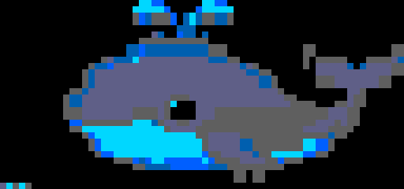

# oh-my-deepseek (omd)

> **English** | [中文](README.zh-CN.md)

<picture>
  
</picture>

**Multi-agent orchestration layer for DeepSeek.** A zero-dependency framework that turns DeepSeek's API into a multi-agent coding system — autonomous execution, parallel team mode, interactive chat, and MCP integration.


## Quick Start

```bash
# Install globally
npm install -g oh-my-deepseek

# Or run directly
npx oh-my-deepseek

# Set your API key
export OMD_API_KEY=sk-your-key-here

# Run in autopilot mode
omd run "refactor the auth module to use JWT"

# Or start interactive chat
omd chat
```

## Commands

| Command | Description |
|---------|-------------|
| `omd run "task"` | Autonomous execution (explore → plan → execute → review → fix) |
| `omd team <N> "task"` | Parallel team of N workers |
| `omd chat` | Interactive chat with intent routing |
| `omd mcp` | Start MCP server (for Claude Code, Codex CLI, Cursor) |
| `omd setup` | Initialize `.omd/` project structure |
| `omd doctor` | Environment and API connectivity check |
| `omd sessions` | List recent sessions |
| `omd agents` | List available agent types |

### Magic Keywords

Use in chat or `run`:

```
$autopilot "implement REST API"   # Force autopilot mode
$team 4 "refactor database"       # Team mode with 4 workers
$ralph "fix performance issue"    # Persistent verify-fix loop
```

## Architecture

### Modes

**Autopilot** — Full pipeline with phase gates:
```
explore → [gate] → plan → [gate] → execute → [gate] → review → [gate] → fix loop (max 3)
```

**Team** — Parallel execution:
```
architect splits task → [gate] → N parallel executors → [gate] → reviewer merges
```

**Chat** — Smart routing:
```
input → intent classifier → debugger / reviewer / architect / explore / executor
```

### Built-in Agents

| Agent | Model | Role |
|-------|-------|------|
| **architect** | deepseek-reasoner | System design, planning, trade-off analysis |
| **executor** | deepseek-chat | Implementation, file creation, commands |
| **debugger** | deepseek-reasoner | Bug diagnosis, root cause analysis |
| **reviewer** | deepseek-chat | Adversarial code review (Claude Nexus-inspired) |
| **explore** | deepseek-chat | Codebase search and understanding |

## Acknowledgments

oh-my-deepseek does not stand alone. It is a synthesis — ideas borrowed, remixed, and recombined from projects that pushed the boundaries of what AI coding agents can do. Each left its mark.

**AgentSys** taught us phase gates — validate stage output before proceeding, catch bad outputs early. The explore→plan→execute→review pipeline runs on this discipline.

**Harmonist** taught us that the LLM should never see tools it cannot use. Tool schemas are filtered at definition time, not at execution time. A quiet but profound insight.

**Structured inter-agent communication** — DELEGATE, REPORT, QUERY, ALERT, APPROVE, REJECT typed messages via mailboxes, letting agents exchange information without chaos.

**ittybitty** taught us recursive sub-agent spawning. An agent can spawn another for a focused sub-task, which can spawn another. The `agent` tool is OMD's central recursion mechanism.

**OMC/OMX** taught us the autopilot pipeline, team mode with parallel workers, and the Ralph verify-fix loop — relentless iteration until the output is right.

**Claude Nexus** taught us adversarial review. Assume every change has hidden problems until proven otherwise. "What's the WORST thing that could go wrong?" changes how you read code.

**autoapp-toolkit** taught us that agents need memory. ADR decision logs, MEMORY.md, cross-session state — so the system learns from its own history.

**Adaptive context compression** — system messages kept intact, recent messages preserved in full, older tool results truncated to summaries. A practical necessity for any long-running agent loop.

To the authors and maintainers of these projects: thank you. OMD is what it is because you showed what was possible.

### Project Structure

```
oh-my-deepseek/
├── agents/              # Agent prompt templates (editable markdown)
│   ├── architect.md
│   ├── debugger.md
│   ├── executor.md
│   ├── explore.md
│   └── reviewer.md
├── src/
│   ├── index.js         # CLI entry point + banner
│   ├── agent.js         # Agent system + execution loop + sub-agent spawning
│   ├── client.js        # DeepSeek API client (native fetch, no deps)
│   ├── config.js        # Config: env >> project >> user >> defaults
│   ├── mailbox.js       # Inter-agent messaging (Houmao)
│   ├── mcp.js           # MCP server (JSON-RPC over stdio)
│   ├── orchestrator.js  # Autopilot / team / chat orchestration
│   ├── state.js         # Session persistence, ADR, memory
│   └── tools/
│       ├── bash.js      # Shell execution
│       ├── file.js      # Read / Write / Edit
│       ├── index.js     # Tool registry
│       └── search.js    # Glob + Grep
├── test/
│   └── mcp-test.js      # MCP protocol tests
└── banner-pixels.txt    # Pixel art banner data
```

## Configuration

Priority: **Environment variables** > **Project `.omd/config.json`** > **User `~/.omd/config.json`** > **Defaults**

```bash
export OMD_API_KEY=sk-...          # API key (falls back to DEEPSEEK_API_KEY)
export OMD_MODEL=deepseek-chat     # Default model
export OMD_REASONER_MODEL=deepseek-reasoner
export OMD_BASE_URL=https://api.deepseek.com
export OMD_MAX_TOKENS=8192
export OMD_TEMPERATURE=0.7
export OMD_DEFAULT_MODE=autopilot   # autopilot, team, chat
```

## MCP Integration

OMD runs as a standard MCP server, compatible with Claude Code, Codex CLI, Cursor, and any MCP client:

```bash
omd mcp
```

Exposed tools: `omd_autopilot`, `omd_team`, `omd_chat`, `omd_explore`, `omd_sessions`, `omd_decisions`, `omd_memory`.

Example Claude Code config:

```json
{
  "mcpServers": {
    "omd": {
      "command": "node",
      "args": ["/path/to/oh-my-deepseek/src/index.js", "mcp"],
      "env": { "OMD_API_KEY": "sk-..." }
    }
  }
}
```

## License

MIT
